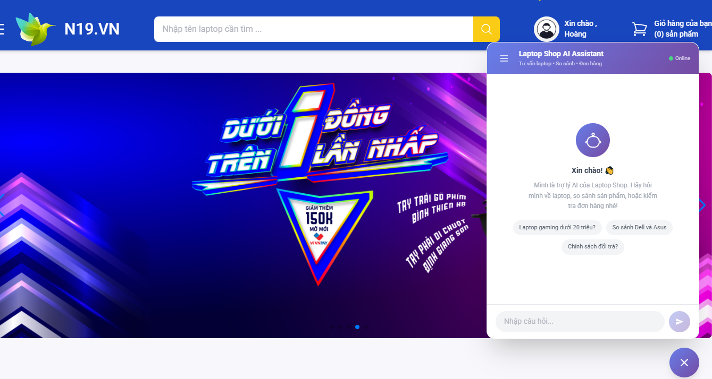

# Xây dựng và phát triển website bán laptop N19.VN

### Mô tả dự án:

## Giới thiệu

LapTopShop là hệ thống thương mại điện tử chuyên bán laptop. Dự án bao gồm một cổng mua sắm dành cho người dùng cuối và một trang quản trị nội bộ, cùng với chatbot AI được fine-tune riêng trên dữ liệu sản phẩm để tư vấn khách hàng theo thời gian thực.

Tính năng nổi bật
🛒 Phía người dùng (Customer)

    Đăng ký / Đăng nhập (Email + Google OAuth2)
        Xác thực tài khoản qua email, đặt lại mật khẩu
        Trang chủ với banner slider, danh sách sản phẩm nổi bật
        Tìm kiếm & lọc nâng cao (theo hãng, giá, cấu hình, ...)
        Trang chi tiết sản phẩm, so sánh sản phẩm
        Giỏ hàng, nhập địa chỉ giao hàng
        Thanh toán: COD, PayPal, VNPay, Số dư tài khoản
        Quản lý đơn hàng cá nhân
        Đánh giá & bình luận sản phẩm
        AI Chatbot tư vấn sản phẩm

## Cấu trúc thư mục

```text
Ecommerce-Fe-master/
├── public/                    # Static assets (ảnh, banner, logo)
│   └── images/
│       └── laptops/           # Ảnh sản phẩm mẫu
├── src/
│   ├── api/                   # Cấu hình Axios + các hàm gọi API
│   │   ├── axiosClient.js     # Axios instance + interceptors
│   │   ├── userApi.js
│   │   ├── productApi.js
│   │   ├── orderApi.js
│   │   ├── reviewApi.js
│   │   ├── commentApi.js
│   │   └── chatApi.js
│   ├── components/            # Các component dùng chung
│   │   ├── header/
│   │   ├── footer/
│   │   ├── navbar/
│   │   └── Chatbot/
│   ├── module/                # Các module theo chức năng
│   │   ├── cart/              # Giỏ hàng
│   │   ├── dashboard/         # Layout trang tài khoản (sidebar)
│   │   ├── feedback/          # Đánh giá & nhận xét
│   │   ├── filter/            # Lọc sản phẩm
│   │   ├── payment/           # Thanh toán
│   │   ├── product/           # Hiển thị sản phẩm
│   │   └── UserProfile/       # Quản lý tài khoản
│   ├── page/                  # Các trang chính (route level)
│   │   ├── HomePage.jsx
│   │   ├── ProductFilterPage.jsx
│   │   ├── ProductDetail.jsx
│   │   ├── SignInPage.jsx
│   │   ├── SignUpPage.jsx
│   │   ├── VerifyPage.jsx
│   │   ├── ForgotPasswordPage.jsx
│   │   ├── ResetPasswordPage.jsx
│   │   └── NotFoundPage.jsx
│   ├── redux/                 # Redux store & slices
│   │   ├── auth/              # userSlice, addressSlice
│   │   ├── cart/              # cartSlice
│   │   ├── feedback/          # feedbackSlice, commentSlice
│   │   ├── order/             # orderSlice
│   │   ├── product/           # productSlice
│   │   └── store.js
│   ├── styles/                # File SCSS/CSS toàn cục
│   ├── utils/                 # Hàm tiện ích & hằng số
│   │   ├── constants/         # key.js, status.js, storage-keys.js
│   │   ├── formatPrice.js
│   │   └── calculateScore.js
│   └── App.jsx                # Route chính của ứng dụng
├── index.html
├── vite.config.js
├── tailwind.config.cjs
└── package.json
```

## Hướng dẫn cài đặt

1. Clone repository

- git clone https://github.com/vandat-snk/N19-TTCS-LapTopShop.git

2. Cài đặt dependencies
   `npm install`
3. Tạo file môi trường
   Tạo file .env ở thư mục gốc (xem phần Biến môi trường).
4. Chạy ở chế độ development
   `npm run dev`
   Ứng dụng sẽ chạy tại http://localhost:5173

### Kết quả đạt được

ChatBot



       


#### Trang chủ


#### Trang đăng nhập


#### Trang quên mật khẩu


#### Trang thông tin tài khoản


#### Trang quản lý thông tin giao nhận hàng


#### Trang lọc sản phẩm nâng cao


#### Trang giỏ hàng


#### Chức năng đánh giá sao và nhận xét


#### Chức năng thanh toán


#### Chức năng so sánh thông số giữa 2 sản phẩm


#### Chức năng tìm kiếm


